### Introduction
Repository contains definition of RAG process based on Qdrant and Elasticsearch retrieval. Data is Polish and comes from Culturax.

Process can be defined by these steps:
- Clarify query if it's ambiguous (run on one of possible interpretations)
- Decompose (add subquestions) if it's complicated
- Generate valid query forms for both engines (keywords division, embedding, ...)
- Retrieve docs from ES and Qdrant
- Do RRF fusion using weights obtained based on query features
- Collect documents for main and subquestion, chunk them and sort based on cosine similarity
- Filter invalid ones out (too short, not relevant)
- Using best chunks, build a prompt and ask model
- If model can't answer or answer is invalid, retry with one of the strategies
- If nothing else can be done and answer still invalid, return to unresolved memory
- If answer is evaluated to be valid, return it

### In depth schema of whole process

```mermaid
flowchart TD
    Start([User Query]) --> GenResult[Generate empty result dict]
    GenResult --> Clarify{Clarification:<br/>needs_clarification?}
    
    Clarify -->|YES| ShowInterp[Show interpretations<br/>and select first]
    Clarify -->|NO| UseOriginal[Use original query]
    
    ShowInterp --> FinalQuery[final_user_input =<br/>query + interpretation]
    UseOriginal --> FinalQuery
    
    FinalQuery --> Decomp{Decomposition:<br/>enable_decomposition?}
    
    Decomp -->|YES| DecompQuery[decompose_query<br/>generate sub_questions]
    Decomp -->|NO| SingleQuery[queries = user_input]
    
    DecompQuery --> BuildQueries[queries_to_process =<br/>user_input + sub_questions]
    SingleQuery --> BuildQueries
    
    BuildQueries --> ExtractMeta[extract_metadata_from_query<br/>NER: entities, places, dates/years]
    
    ExtractMeta --> LoopQueries[For each query in queries_to_process]
    
    LoopQueries --> MakeQueries[make_queries:<br/>qdrant_query + es_query]
    MakeQueries --> Embed[embed: generate vector]
    
    Embed --> QdrantSearch[search_qdrant_enhanced<br/>with filters: years]
    Embed --> ESSearch[search_es_enhanced<br/>with boosts: entities, places, years]
    
    QdrantSearch --> Weights[choose_weights<br/>based on analyze_query]
    ESSearch --> Weights
    
    Weights --> RRF[rrf_fusion_weighted<br/>combine results with weights<br/>k=15]
    
    RRF --> ChunkDocs[chunk_document<br/>max_tokens=200]
    ChunkDocs --> AddScores[Add chunks + scores<br/>to all_chunks_with_scores]
    
    AddScores --> NextQuery{More queries?}
    NextQuery -->|YES| LoopQueries
    NextQuery -->|NO| Deduplicate
    
    Deduplicate[Deduplicate chunks:<br/>keep max score] --> SortChunks[Sort chunks<br/>descending by score]
    
    SortChunks --> Filter[filter_retrieved_with_stats<br/>min_tokens=20<br/>cosine_sim >= 0.75<br/>max_docs=10]
    
    Filter --> TokenLimit[Token limit:<br/>max_tokens_len=350<br/>iteratively add chunks]
    
    TokenLimit --> AskModel[ask_model:<br/>build_prompt + ollama.chat<br/>temp=0.6]
    
    AskModel --> ExtractAnswer[Extract answer<br/>and count_citations]
    
    ExtractAnswer --> IsValid{is_answer_valid?}
    
    IsValid -->|YES| Success([Return result])
    IsValid -->|NO| RetryLoop{Retry strategies}
    
    RetryLoop -->|modify_prompt| NextPrompt{prompt_idx + 1<br/>< len prompts?}
    NextPrompt -->|YES| UseNextPrompt[Use next prompt<br/>and retry ask_model]
    NextPrompt -->|NO| RemoveStrategy1[Remove 'modify_prompt'<br/>from retry_strategies]
    
    UseNextPrompt --> IsValid
    RemoveStrategy1 --> RetryLoop
    
    RetryLoop -->|change_interpretation| NextInterp{interp_idx + 1<br/>< len interpretations?}
    NextInterp -->|YES| UseNextInterp[Use next interpretation<br/>and restart full RAG]
    NextInterp -->|NO| RemoveStrategy2[Remove 'change_interpretation'<br/>from retry_strategies]
    
    UseNextInterp --> BuildQueries
    RemoveStrategy2 --> RetryLoop
    
    RetryLoop -->|save_to_memory| SaveMem[memory.add_query<br/>Save query]
    SaveMem --> ReturnPartial([Return result<br/>with partial answer])
    
    RetryLoop -->|unknown| SaveUnknown[memory.add_query<br/>Unknown strategy]
    SaveUnknown --> ReturnPartial
    
    style Start fill:#2d5f2d,stroke:#4a8f4a,color:#fff
    style Success fill:#2d5f2d,stroke:#4a8f4a,color:#fff
    style ReturnPartial fill:#8b3a3a,stroke:#c55,color:#fff
    style IsValid fill:#b8860b,stroke:#daa520,color:#fff
    style RetryLoop fill:#4a5f8f,stroke:#6a8fcc,color:#fff
    style Filter fill:#8b4789,stroke:#b56fb5,color:#fff
    style RRF fill:#6a4c93,stroke:#9370db,color:#fff
```


### File structure
```
├── elasticsearch
│   └── Dockerfile                  # Builds elasticsearch image with morfologik
│
├── rag
│   ├── common                      # Entrypoint for the FastAPI application
│   │   ├── __init.py__
│   │   ├── data.py                 # Makes sure databases have data injected
│   │   └── util.py                 # Common util functions
│   │
│   ├── data                        # Contains ndjson file that populates database data
│   │
│   ├── memory
│   │   └── unresolved_memory.py    # Defines unresolved questions memory container
│   │
│   ├── reasoning
│   │   ├── __init.py__
│   │   ├── chunking.py             # Divides data from databases and splits them into chunks
│   │   ├── clarification.py        # System making sure that query is unambiguous
│   │   ├── decomposition.py        # Adds subquestions to complicated and ambiguous queries
│   │   ├── filtering.py            # Removes invalid documents retrieved from databases
│   │   ├── prompt.py               # Builds prompts for model
│   │   └── validation.py           # Makes sure model answer is valid
│   │
│   ├── retrieval
│   │   ├── __init.py__
│   │   ├── elastic.py              # Finds documents in ES index
│   │   ├── fusion.py               # Runs RRF to get best docs from both es and qdrant
│   │   └── qdrant.py               # Finds documents in qdrant collection
│   │
│   ├── config.py                   # Defined configuration
│   ├── main.py                     # FastAPI entrypoint (with endpoints definitions)
│   ├── rag.py                      # Defines a class running whole RAG logic
│   └── requirements.txt            # Python dependecies
│
├── docker-compose.yml               # Project build definition
└── README.md                        # Project documentation       
```

### HOW TO RUN
- `docker compose up -d`
- go to `localhost:8000/docs` in browser (to access swagger) or just curl to `localhost:8000`
- to check unresolved queries, use other endpoint or enter container using `docker exec -it $(docker ps | grep fastapi | awk '{ print $1 }') cat memory/unresolved_queries.json`

### ENCOUNTERED ERRORS
- Error response from daemon: failed to set up container networking: driver failed programming external connectivity on endpoint ollama (3383e7a3034f2b4748c23133ad13395472b812f9424860753529e1abae9ef5af): failed to bind host port for 0.0.0.0:11434:172.23.0.4:11434/tcp: address already in use \
FIX: `sudo systemctl stop ollama`

### EXAMPLE

REQUEST:
```bash
curl -X 'POST' \
  'http://localhost:8000/ask?query=pomys%C5%82%20na%20prezent' \
  -H 'accept: application/json' \
  -H 'Content-Type: application/json' \
  -d '{
  "retry_strats": [
    "change_interpretation",
    "modify_prompt",
    "save_to_memory"
  ]
}'
```

RESPONSE_BODY:
```json
{
  "model_answer": {
    "original_query": "pomysł na prezent",
    "answer": "[1] SŁOIKI TEMATYCZNE Świetny pomysł na prezent, gdy dobrze znamy zainteresowania obdarowywanej osoby – w tym przypadku przyda się duży słoik, który pomieści jak najwięcej gadżetów! \n",
    "chunks": [
      "SŁOIKI TEMATYCZNE Świetny pomysł na prezent, gdy dobrze znamy zainteresowania obdarowywanej osoby – w tym przypadku przyda się duży słoik, który pomieści jak najwięcej gadżetów!",
      "Pobierz DAR Load More... Follow on Instagram Linki Polityka Prywatności Regulamin sprzedaży Powrót na górę ©2021 Logopestka.pl Blog logopedyczny Oparte na Anima & WordPress.",
      "Czytaj cały artykuł cookies a sklep internetowydane osobowedane osobowe w sklepie internetowymGIODOinstrukcja GIODOinstrukcja wypełniania formularza GIODOjak napisać politykę prywatnościobowiązek informacyjny w zakresie danychpolityka prywatnościpolityka prywatności dla sklepu internetowegopolityka prywatności w e-sklepieskąd wziąć politykę prywatnościsklep internetowy a polityka prywatnościwzór polityki prywatności Zapisz się do newslettera Regularnie otrzymuj powiadomienia o nowych materiałach.",
      "Sylwia Fallopia 20 lutego 2017 11:27 Uroczy szkrab, zdrówka mu życzę :) Świetne prezenty przygotowałaś :) Małgorzata Zoltek 20 lutego 2017 17:05 Piotruś zuch chłopak i jaki wesoły.",
      "Share on Facebook Share Share on TwitterTweet Share on Pinterest Share Dodaj komentarz Anuluj pisanie odpowiedzi Twój adres e-mail nie zostanie opublikowany.",
      "Dodaj komentarz Anuluj pisanie odpowiedzi Komentarz Nazwa * E-mail * Witryna internetowa Zapisz moje dane, adres e-mail i witrynę w przeglądarce aby wypełnić dane podczas pisania kolejnych komentarzy."
    ],
    "decomposition": {
      "main_question": "Pytanie o pomysł na prezent",
      "sub_questions": [],
      "decomposition_type": "simple"
    },
    "stats": {
      "tokens_used": 207,
      "input_docs": 15,
      "kept_docs": 7,
      "rejected_short": 8,
      "rejected_overlap": 0,
      "overlaps": [
        2,
        0,
        0,
        0,
        0,
        0,
        0
      ],
      "citations": 1
    },
    "clarification": {
      "needs_clarification": false,
      "original_query": "pomysł na prezent",
      "interpretations": [],
      "method": "heuristic_clear"
    }
  }
}
```

